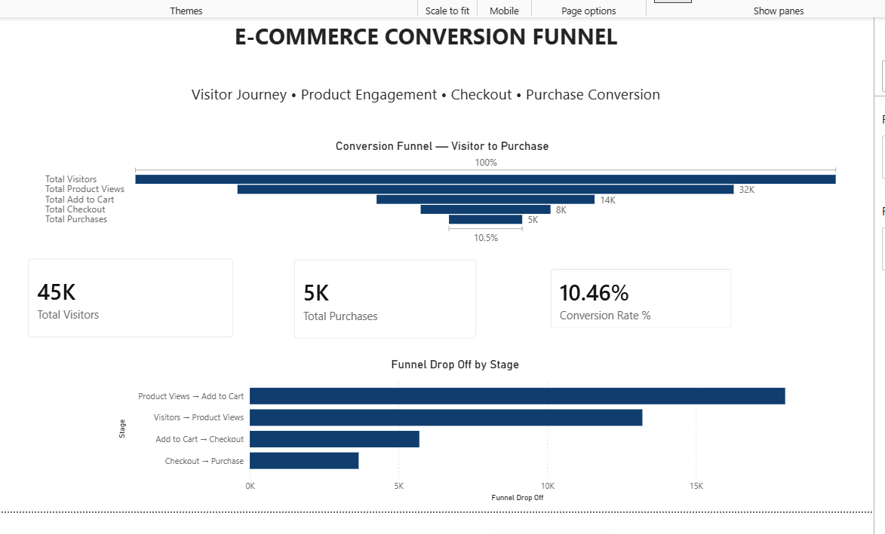
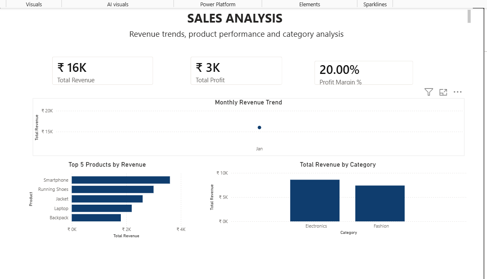
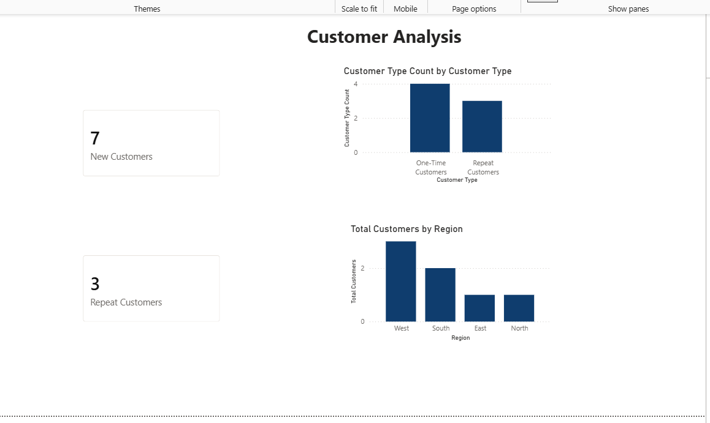

# E-Commerce Sales Funnel & Customer Analytics Dashboard

## 📊 Project Overview

An interactive Power BI dashboard built to analyze e-commerce sales performance, customer behavior, product performance, profitability, and conversion funnel performance.

The project demonstrates practical skills in data modeling, DAX, KPI development, data visualization, and interactive dashboard design.

---

## 🎯 Business Objectives

The dashboard answers key business questions:

- What is the total revenue and profit?
- Which products and categories generate the most revenue?
- Which regions contribute the most sales?
- How many customers are new versus repeat customers?
- Where are customers dropping off in the conversion funnel?
- What percentage of visitors convert into purchases?
- Which areas could be investigated to improve sales and conversion?

---

## 🛠️ Tools & Technologies

- Power BI Desktop
- DAX
- Power Query
- Data Modeling
- Star Schema
- Excel / Tabular Data
- GitHub

---

## 🗂️ Data Model

The project uses a Star Schema consisting of fact and dimension tables.

### Fact Tables

#### Fact_Sales

- Order_ID
- Customer_ID
- Product_ID
- Order_Date
- Quantity
- Sales
- Profit

#### Fact_Funnel

- Date
- Visitors
- Product_Views
- Add_to_Cart
- Checkout
- Purchase

### Dimension Tables

#### Dim_Customer

- Customer_ID
- Customer_Name
- Region

#### Dim_Product

- Product_ID
- Product
- Category

#### Dim_Date

- Date
- Year
- Month Number
- Month
- Month Year
- Quarter

---

## 📌 Key KPIs

| KPI | Result |
|---|---:|
| Total Revenue | ₹16,000 |
| Total Orders | 10 |
| Total Customers | 7 |
| Total Profit | ₹3,200 |
| Profit Margin | 20% |
| Total Visitors | 45,300 |
| Total Purchases | 4,740 |
| Conversion Rate | 10.46% |
| New Customers | 7 |
| Repeat Customers | 3 |

---

# 📄 Dashboard Pages

## 1. Executive Overview

Provides a high-level view of:

- Revenue
- Orders
- Customers
- Profit
- Conversion Rate
- Revenue by month
- Revenue by category
- Revenue by region
- Product performance



---

## 2. Sales Analysis

Analyzes:

- Revenue trends
- Total profit
- Profit margin
- Top 5 products by revenue
- Revenue by category



---

## 3. Customer Analysis

Analyzes:

- New customers
- Repeat customers
- One-time versus repeat customers
- Customer distribution by region



---

## 4. Conversion Funnel

Tracks the customer journey:

**Visitors → Product Views → Add to Cart → Checkout → Purchase**

The page includes:

- Total Visitors
- Total Purchases
- Conversion Rate
- Funnel visualization
- Funnel drop-off analysis


---

# 🧮 Key DAX Measures

### Total Revenue

```DAX
Total Revenue =
SUM(Fact_Sales[Sales])

Total Orders =
DISTINCTCOUNT(Fact_Sales[Order_ID])

Total Customers =
DISTINCTCOUNT(Fact_Sales[Customer_ID])

Total Profit =
SUM(Fact_Sales[Profit])

Profit Margin % =
DIVIDE(
    [Total Profit],
    [Total Revenue]
)

Total Visitors =
SUM(Fact_Funnel[Visitors])

Total Purchases =
SUM(Fact_Funnel[Purchase])

Conversion Rate % =
DIVIDE(
    [Total Purchases],
    [Total Visitors]
)

New Customers =
VAR CustomerFirstPurchase =
    ADDCOLUMNS(
        VALUES(Fact_Sales[Customer_ID]),
        "FirstPurchaseDate",
            CALCULATE(
                MIN(Fact_Sales[Order_Date]),
                ALL(Fact_Sales)
            )
    )
RETURN
    COUNTROWS(
        FILTER(
            CustomerFirstPurchase,
            [FirstPurchaseDate] >= MIN(Dim_Date[Date])
                &&
            [FirstPurchaseDate] <= MAX(Dim_Date[Date])
        )
    )

Repeat Customers =
COUNTROWS(
    FILTER(
        VALUES(Fact_Sales[Customer_ID]),
        CALCULATE(
            DISTINCTCOUNT(Fact_Sales[Order_ID])
        ) > 1
    )
)

💡 Key Business Insights

Based on the sample dataset:

Electronics generated ₹8,600 in revenue compared with ₹7,400 from Fashion.
West generated the highest regional revenue at ₹9,000.
Overall visitor-to-purchase conversion is 10.46%.
The dataset contains 7 customers, including 3 repeat customers.
The funnel shows significant volume reduction as users progress from visitors toward purchase.
📈 Recommendations

Based on the dashboard analysis:

Investigate the drop between visitors and product views.
Analyze product-page engagement to identify potential conversion improvements.
Monitor high-performing products and categories.
Develop strategies to encourage repeat purchases.
Analyze regional performance to identify opportunities for growth.
🔍 Interactive Features

The dashboard includes:

Year filtering
Region filtering
Category filtering
Interactive visuals
Page navigation buttons
Drill-through analysis
Dynamic DAX measures
Funnel analysis
📚 Skills Demonstrated

This project demonstrates practical experience with:

Data cleaning
Data modeling
Star schema design
Relationships
DAX
Time intelligence
KPI development
Customer analysis
Funnel analysis
Data visualization
Dashboard design
Business insights
📁 Project Structure
ecommerce-sales-funnel-customer-analytics/
│
├── README.md
├── Ecommerce_Sales_Funnel_Customer_Analytics.pbix
│
└── screenshots/
    ├── executive-overview.png
    ├── sales-analysis.png
    ├── customer-analysis.png
    └── conversion-funnel.png
⚠️ Dataset Disclaimer

This project uses a small synthetic dataset created for learning and portfolio demonstration purposes.

The KPI values and business insights are therefore illustrative and should not be interpreted as actual company performance.

👨‍💻 Author

Parag Gunjal

Data Analytics Portfolio Project

Skills: Power BI | DAX | Power Query | Data Modeling | SQL | Excel | Data Visualization
